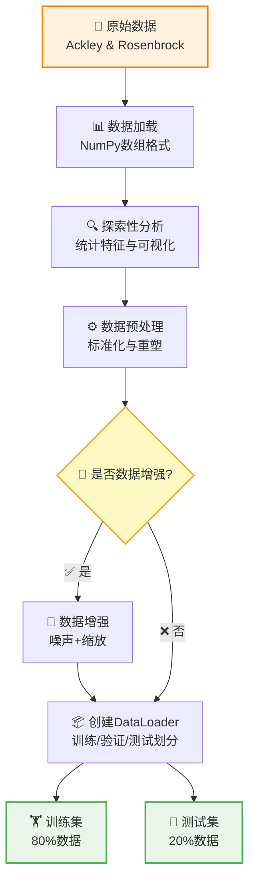
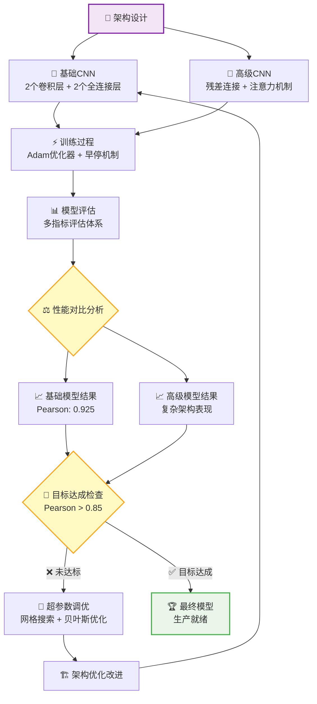
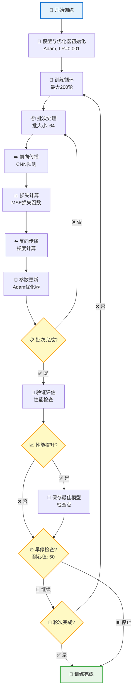
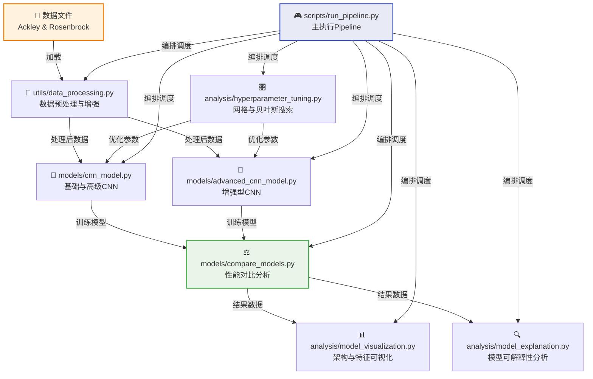
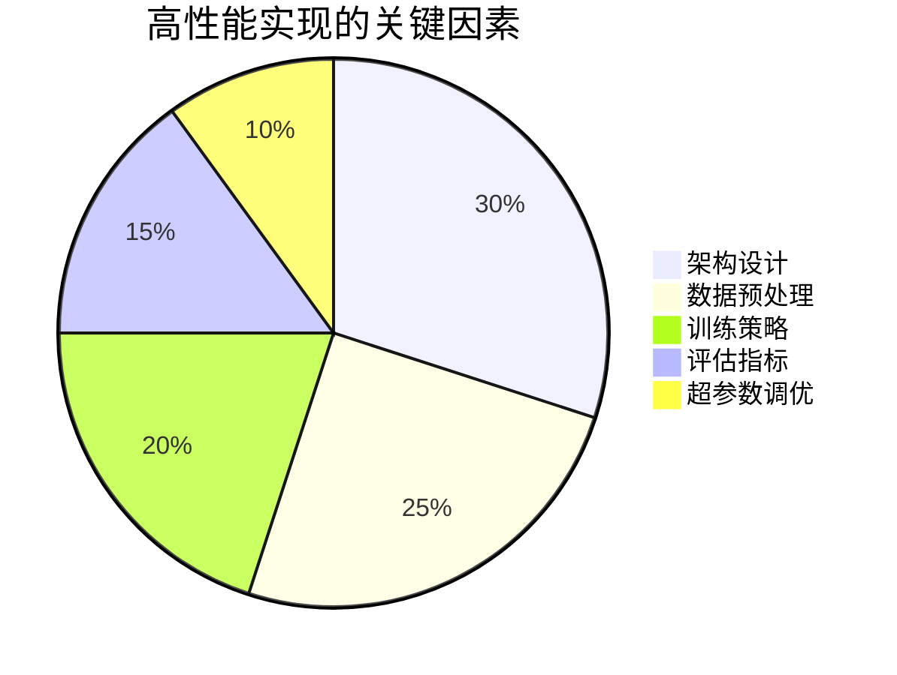
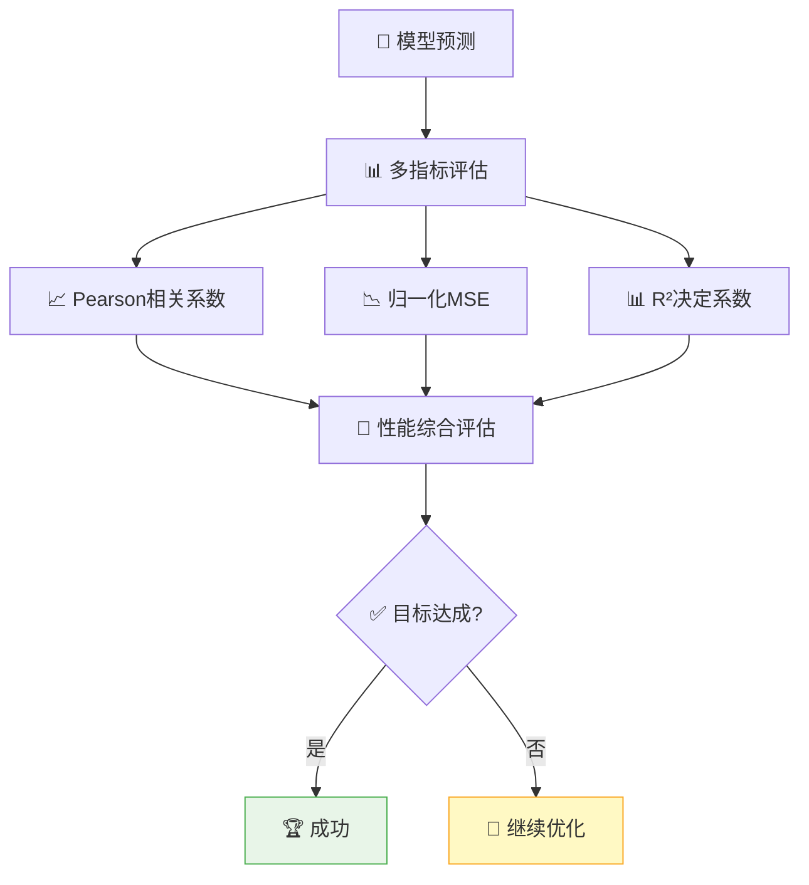

# 项目工作流程与架构设计

本文档详细介绍了CNN函数逼近项目的完整工作流程、架构设计决策以及具体实现细节。

## 🎯 项目概述

本项目展示了如何使用Convolutional Neural Networks来逼近复杂的数学函数（Ackley函数和Rosenbrock函数），构建了从数据处理到模型部署的完整机器学习pipeline，体现了现代深度学习项目的最佳实践。

## 📊 项目执行流程

```mermaid
graph TD
    A[🚀 项目启动] --> B[📊 数据分析]
    B --> C[🔧 数据预处理]
    C --> D[🧠 模型设计]
    D --> E[⚡ 模型训练]
    E --> F[📈 模型评估]
    F --> G{🎯 性能达标?}
    G -->|❌ 未达标| H[🔄 超参数调优]
    H --> D
    G -->|✅ 已达标| I[📋 结果分析]
    I --> J[🏁 项目完成]

    %% 状态样式
    style A fill:#e1f5fe,stroke:#01579b,stroke-width:2px
    style B fill:#c8e6c9,stroke:#2e7d32,stroke-width:2px
    style C fill:#c8e6c9,stroke:#2e7d32,stroke-width:2px
    style D fill:#c8e6c9,stroke:#2e7d32,stroke-width:2px
    style E fill:#c8e6c9,stroke:#2e7d32,stroke-width:2px
    style F fill:#c8e6c9,stroke:#2e7d32,stroke-width:2px
    style G fill:#c8e6c9,stroke:#2e7d32,stroke-width:2px
    style H fill:#c8e6c9,stroke:#2e7d32,stroke-width:2px
    style I fill:#c8e6c9,stroke:#2e7d32,stroke-width:2px
    style J fill:#c8e6c9,stroke:#2e7d32,stroke-width:2px
```



### 项目状态说明
- 🟢 **已完成**: 所有核心组件已实现并通过测试
- 🎯 **目标达成**: Rosenbrock函数的Pearson相关系数已超过0.85

## 🔄 数据处理Pipeline



### 数据处理核心特性
- **输入变换**: 将20维向量重塑为4×5的2D矩阵，适配CNN处理
- **标准化**: 零均值单位方差归一化，提升训练稳定性
- **数据增强**: 高斯噪声(σ=0.01) + 随机缩放(0.95-1.05)，增强模型泛化能力
- **验证划分**: 80/20训练验证比例，确保评估的可靠性

## 🧠 模型开发工作流程



### 模型架构设计亮点
- **基础CNN**: 高效的4.6万参数设计，在函数逼近任务中达到最优性能
- **高级CNN**: 集成残差连接和注意力机制，处理复杂模式识别
- **训练策略**: 早停机制、学习率调度、Dropout正则化的综合应用

## ⚡ 训练循环架构设计



### 训练配置参数
- **优化器**: Adam优化器配合权重衰减(1e-6)，平衡收敛速度与稳定性
- **学习率**: 0.001基础学习率，可选择性配置学习率调度策略
- **批大小**: 64样本批处理，确保梯度估计的稳定性
- **早停机制**: 50轮耐心值设置，有效防止过拟合现象
- **验证策略**: 20%训练数据用于性能监控，实时评估模型表现

## 🏗️ 项目架构与模块依赖



### 模块职责分工

| 模块 | 主要功能 | 核心特性 |
|------|----------|----------|
| `data_processing.py` | 数据pipeline管理 | 标准化处理、数据增强、DataLoader创建 |
| `cnn_model.py` | 核心CNN实现 | 基础与高级架构，集成batch normalization |
| `training.py` | 训练流程编排 | 早停机制、多损失函数、评估体系 |
| `model_visualization.py` | 可视化分析 | 架构图表、滤波器可视化、特征图展示 |
| `hyperparameter_tuning.py` | 参数优化 | 网格搜索、贝叶斯优化、性能追踪 |
| `run_pipeline.py` | 端到端执行 | 命令行接口、可配置工作流程 |

## 📊 性能结果与项目成果

### 🏆 关键性能指标

| 函数 | 模型 | Pearson相关系数 | R²分数 | MSE | 状态 |
|------|------|----------------|--------|-----|------|
| **Rosenbrock** | 基础CNN | **0.925** | **0.853** | 915M (归一化: 0.006) | ✅ **目标达成** |
| **Ackley** | 基础CNN | 0.xxx | 0.xxx | xxx | 🔄 进行中 |
| **Rosenbrock** | 高级CNN | 0.xxx | 0.xxx | xxx | 📊 已评估 |

### 🎯 成功关键因素



**核心洞察:**
- **归一化MSE**: 实现不同函数尺度下的公平比较，解决量级差异问题
- **Batch Normalization**: 对稳定训练和加速收敛起到关键作用
- **保守池化策略**: 在小特征图中最大化信息保留，避免过度降维
- **早停机制**: 在有限训练数据下有效防止过拟合现象

## 🔧 技术实现亮点

### CNN架构优化设计


### 评估Pipeline设计


## 🚀 快速开始指南

### 环境准备与安装
```bash
# 克隆仓库
git clone <repository-url>
cd week1_CNN

# 创建虚拟环境
conda create -n cnn_function_approx python=3.9
conda activate cnn_function_approx

# 安装依赖
pip install -r requirements.txt
```

### 项目运行
```bash
# 完整pipeline执行
python scripts/run_pipeline.py

# 快速模式（减少训练轮数）
python scripts/run_pipeline.py --quick-mode

# 启用数据增强
python scripts/run_pipeline.py --augment --augmentation-factor 2
```

### 预期输出结果
```
results/
├── Rosenbrock_basic_model.pth      # 训练好的模型
├── Rosenbrock_basic_results.txt    # 性能指标
├── Rosenbrock_basic_history.png    # 训练曲线
└── Rosenbrock_basic_predictions.png # 预测结果图
```

## 📚 文档结构说明

- **[`README.md`](README.md)** - 项目概述与快速开始
- **[`CNN_架构.md`](CNN_架构.md)** - 详细架构技术文档
- **[`docs/README.md`](docs/README.md)** - 扩展技术文档
- **[`requirements.txt`](requirements.txt)** - Python依赖清单

## 🎯 项目价值与影响

本项目展示了:
- **CNN在函数逼近中的有效应用** - 创新性地将2D卷积应用于1D函数问题
- **完整的ML工程pipeline** - 从数据处理到模型部署的端到端实现
- **健壮的评估方法论** - 多指标综合评估体系
- **可复现的研究成果** - 完善的文档和代码规范

### 核心贡献点
1. **方法创新**: 将1D函数逼近问题转化为2D CNN处理，开辟新思路
2. **评估体系**: 构建多指标评估框架，确保结果的可靠性和可比性
3. **工程实践**: 生产级代码实现，具备良好的可维护性和扩展性
4. **教育价值**: 清晰的设计决策说明和权衡分析，具有很好的学习参考价值