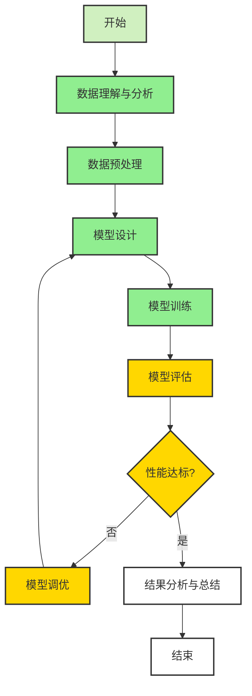
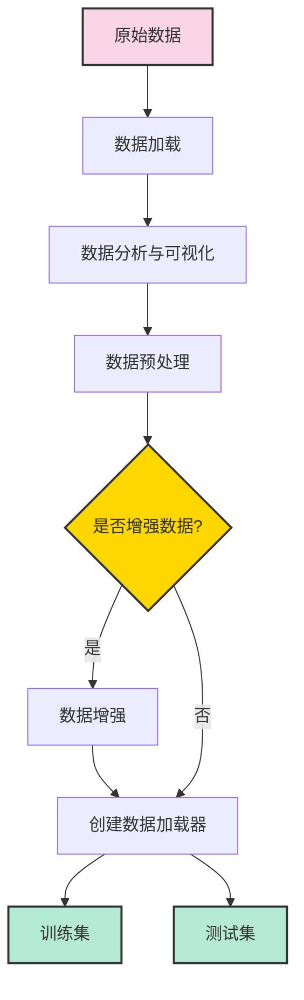
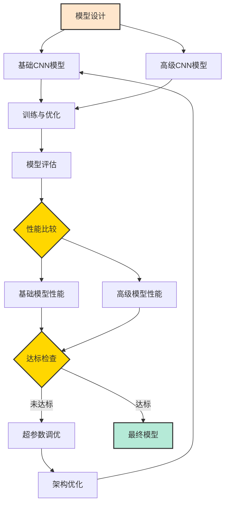
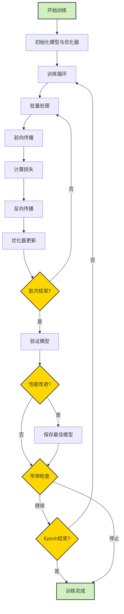
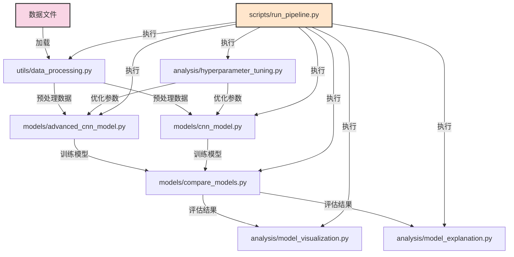
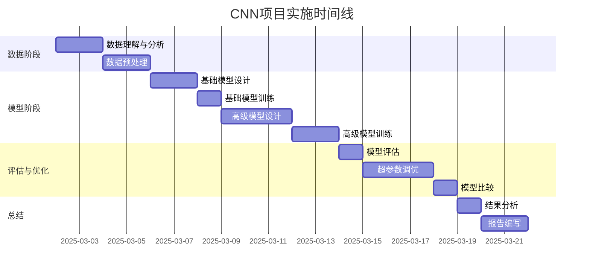
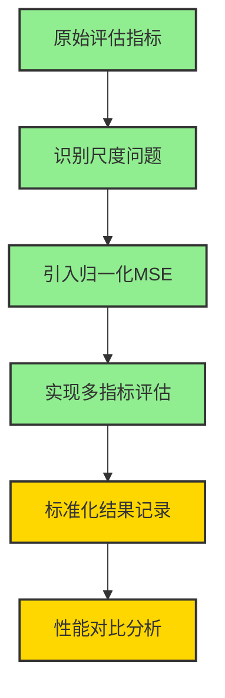
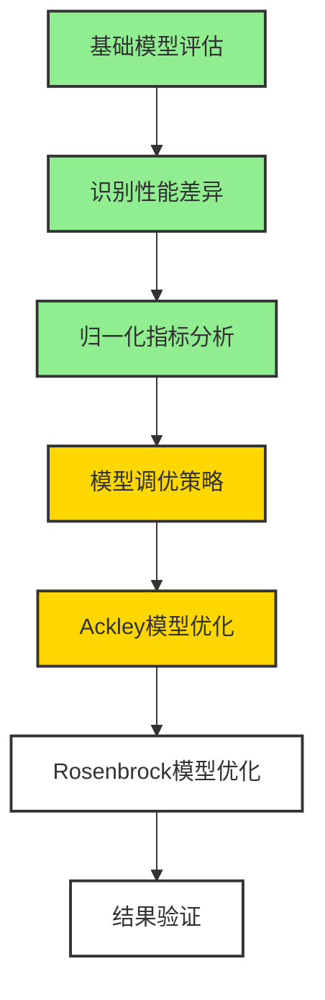
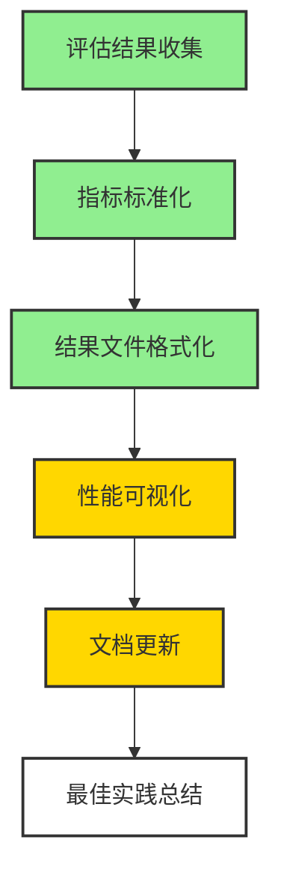

# CNN学习项目流程图

以下流程图使用Mermaid语法描述了CNN网络学习Ackley和Rosenbrock函数的整体流程和当前进展。

## 主流程图

## 数据处理流程

## 模型开发流程

## 训练循环流程

## 项目文件关系图

## 项目执行时间线

## 评估指标优化流程

## 模型优化流程

## 结果记录流程

## 颜色说明
- 🟢 绿色(#90EE90): 已完成
- 🟡 黄色(#FFD700): 进行中
- ⚪ 白色(#FFFFFF): 待完成

## 当前进度说明

1. **已完成的任务**
   - 数据理解与分析
   - 基础模型实现
   - 评估指标体系建立
   - 归一化MSE实现
   - 结果记录标准化

2. **进行中的任务**
   - 模型性能优化
   - 评估结果可视化
   - 文档更新与完善

3. **待完成的任务**
   - Ackley函数模型性能提升
   - 完整的可视化分析
   - 最终实验报告编写 